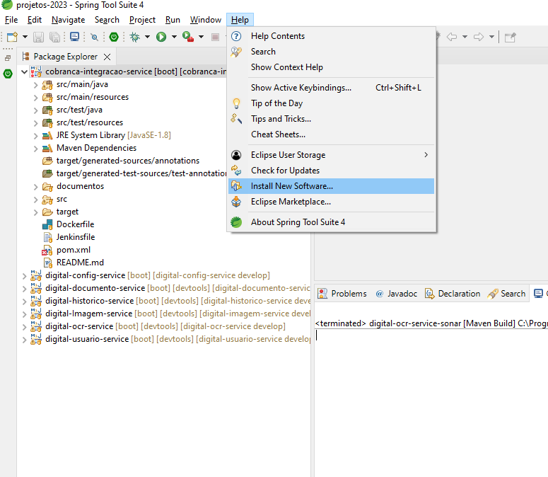
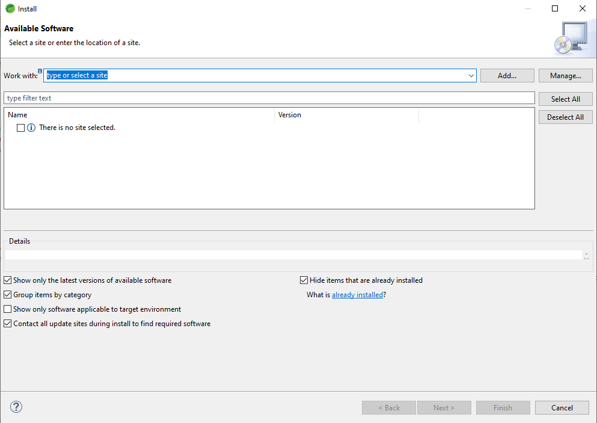
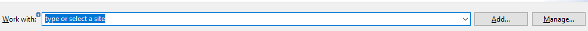
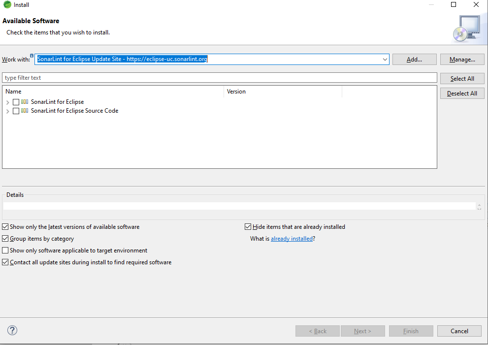

## Support & Feedback 
Este projeto é mantido por Eduardo Nofre. Por favor, entenda que não poderemos fornecer suporte individual por e-mail. Acredito também que a ajuda é muito mais valiosa se for partilhada publicamente, para que mais pessoas possam beneficiar dela.

## modelo-Micro-Services 

Modelo de micro services para uso no dia  a dia.
Tem como objetivo servi como um modelo de construção de micro serviço Java. Um padrão a ser seguido.

   <a href="#requisitos-para-o-desenvolvimento-backend">Requisitos Backend</a> •
   <a href="#ide-eclipse">Ide Eclipse</a> •
   <a href="#configurar-sonar-no-eclipse">Sonar</a> •
   <a href="#configurar-jacoco">Jacoco</a> •
   <a href="#plugin-sonarlint">sonarlint</a> 

## `Requisitos para o desenvolvimento Backend`
- Eclipse STS 4.19
- JAVA 11 
- Plugin SonarLint
- Spring boot 
- Spring Cloud OpenFeign
- JPA
- Swagger 
- ModelMapper 
- jacoco 
- Lombok

  <h1 align="center">
       Configurações do eclipse para o projeto
   </h1>
   
### 'Configurar sonar no eclipse'
#### Passo 1: 
   • Vá ate o seu projeto e clique bom o botão direito sobre ele. Será exibidas algumas opções.  
#### Passo 2:  
   • Va ate o a opção "Run As".  
#### Passo 3:  
   • Selecione a opção "5 Maven Build..."  
        
#### Esta imagem mostra os passos 1,2 e 3.  

#### Passo 4:  
   • Ao selecione a opção "5 Maven Build...! Será exibida a tela como mostra a imagem abaixo. 
  

  
#### Passo 5: 
   • Note que na imagem acima o botão "Add..." está cirluado. 
#### Passo 6: 
   • Clique no label "Goals" e insira o seguinte valor org.sonarsource.scanner.maven:sonar-maven-plugin:3.3.0.603:sonar; 
    
   
  
#### Passo 7: 
   • Clique em "Add..." e a seguinte tela será exibida.  
   • Insira as seguintes propriedades. 
   
   Propriedade: sonar.host.url
    Valor: http://seuIP:9000/
   
   Propriedade-> sonar.login
    Valor: seu usuario
   
   Propriedade-> sonar.password
    Valor: senha senha 
   
   No final deve ficar algo parecido com a imagem abaixo  

   
  
Passo 8:  
   • Adicionado as as propriedades clique em Apply e depois m Run. 
  
### Configurar Jacoco
#### Passo 1: 
   • Vá ate o seu projeto e clique bom o botão direito sobre ele. Será exibidas algumas opções. 
 #### Passo 2: 
   • Va ate o a opção "Run As". 
 #### Passo 3: 
   • Selecione a opção "5 Maven Build..." 
        
  #### Esta imagem mostra os passos 1, 2 e 3.

   

#### Passo 4: 
   • Ao selecione a opção "5 Maven Build...! Será exibida a tela como mostra a imagem abaixo. 
  
   
  
#### Passo 5: 
   • Note que na imagem acima o botão "Add..." está cirluado. 
#### Passo 6: 
   • Clique no label "Goals" e insira o seguinte valor org.jacoco:jacoco-maven-plugin:prepare-agent verify 

#### Passo 7: 
• Clique em "Add..." e a seguinte tela será exibida.  
• Insira as seguintes propriedades.  

Propriedade: surefire.useFile 
 Valor: false   

Propriedade: skip.failsafe.tests 
 Valor:true 
   
   No final deve ficar algo parecido com a imagem abaixo  

  
#### Passo 8:  
   • Adicionado as as propriedades clique em Apply e depois m Run. 
  
### 'Plugin sonarLint'
#### Passo 1: 
   • Abra o eclipse  
#### Passo 2:   
   • Procure na barra de ferramentas o opção Help e clique no mesmo.  
   Esta imagem contepla os passos 1 e 2

   
#### Passo 3:   
   • Selecione a opção install new software. Uma nova janela se abrirá.  
   Como esta na imagem

#### Passo 4:   
  • Insira o valor no label "Work with": SonarLint for Eclipse Update Site - https://eclipse-uc.sonarlint.org  

#### Passo 5: 
• Após inserir o  valor em "Work with".Para finalizar e so next,next e finish
  

  <h1 align="center">
       Utlização dos protocolos devem seguir o padrão abaixo.
   </h1>
   

   <a href="#protocolos">Protocolos</a> •
   <a href="#verbos">Verbos</a>

## Protocolos
### HTTP 200: 
• Deve ser usado para consultas que tenha algum retorno : 200 ok  
      
#### HTTP 201: 
• Deve ser usado persistencia de dados com sucesso : 201 create  

#### HTTP 204: 
• Deve ser usado para consultas que não encontrou um determinado valor no banco : 204 no content  
      
#### HTTP 409: 
• Ficou definido no hanlde excption como aviso de regra de negocio não atendida. 409 no conflit  

#### HTTP 401  
• Acesso negado sem autorização. 401 Unauthorized    

#### HTTP 500  
• Erro sem causa mapeada. 500 Internal Server Error    

## Verbos 
• GET uma representação do recurso de destino; 
• HEAD a mesma representação que GET, mas sem os dados de representação; 
• POST uma representação do status ou resultados obtidos da ação; 
• PUT ou DELETE uma representação do status da ação; 
• OPTIONS uma representação das opções de comunicação; 
• TRACE uma representação da mensagem de solicitação recebida pelo servidor final. 
