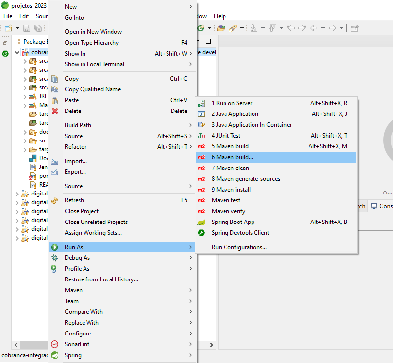
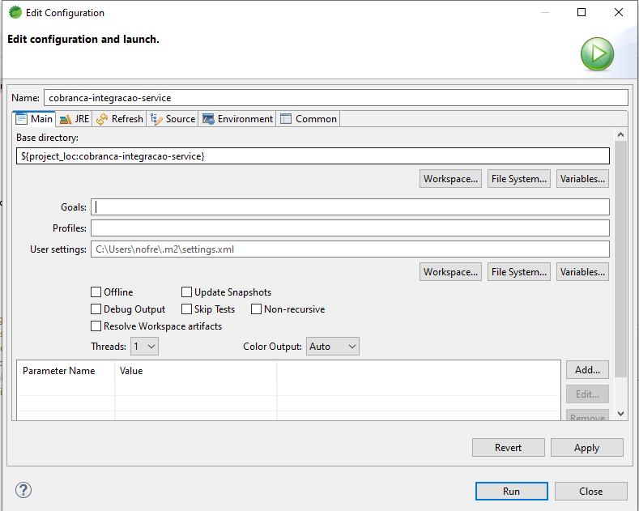
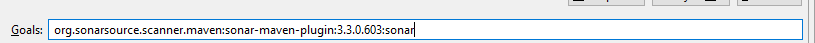
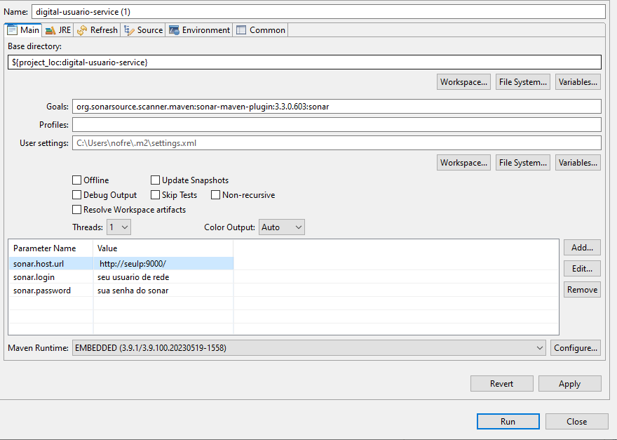
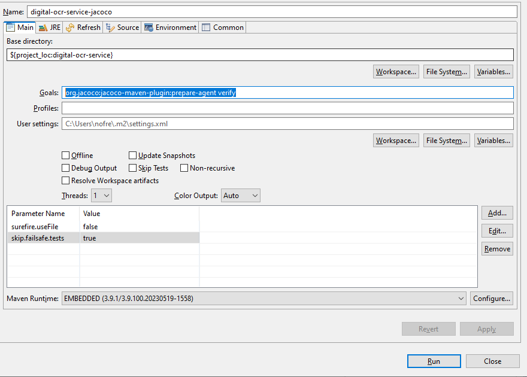

## Support & Feedback 
Este projeto é mantido por Eduardo Nofre. Por favor, entenda que não poderemos fornecer suporte individual por e-mail. Acredito também que a ajuda é muito mais valiosa se for partilhada publicamente, para que mais pessoas possam beneficiar dela.

## modelo-Micro-Services 

Modelo de micro services para uso no dia  a dia.
Tem como objetivo servi como um modelo de construção de micro serviço Java. Um padrão a ser seguido.

   <a href="#ambiente-dev-backend">Ambiente Backend</a> •
   <a href="#infra-estrutura-aws">Ide Eclipse</a> •
  <a href="#ambiente-dev-front">Ambiente Front</a>

## `Requisito para o desenvolvimento Backend`
- Eclipse STS 4.19
- JAVA 11 
- Plugin SonarLint
- Spring boot 
- Spring Cloud OpenFeign
- JPA
- Swagger 
- ModelMapper 
- jacoco 
- Lombok

## `Ide Eclipse`
### Configurar sonar no eclipse 
     Passo 1: 
        • Vá ate o seu projeto e clique bom o botão direito sobre ele. Será exibidas algumas opções. 
     Passo 2: 
        • Va ate o a opção "Run As". 
     Passo 3: 
        • Selecione a opção "5 Maven Build..." 
        
  #### Esta imagem mostra os passos 1,2 e 3.

     Passo 4: 
        • Ao selecione a opção "5 Maven Build...! Será exibida a tela como mostra a imagem abaixo. 
  
     
  
     Passo 5: 
        • Note que na imagem acima o botão "Add..." está cirluado. 
     Passo 6: 
        • Clique no label "Goals" e insira o seguinte valor org.sonarsource.scanner.maven:sonar-maven-plugin:3.3.0.603:sonar; 
    
   
  
     Passo 7: 
        • Clique em "Add..." e a seguinte tela será exibida.  
        • Insira as seguintes propriedades.  
            sonar.host.url  http://seuIP:9000/  
            sonar.login seu usuario  
            sonar.password senha senha              
        No final deve ficar algo parecido com a imagem abaixo  

   
  
   Passo 8:  
       • Adicionado as as propriedades clique em apply e depois m Run. 
  
### Configurar Jacoco
 Passo 1: 
        • Vá ate o seu projeto e clique bom o botão direito sobre ele. Será exibidas algumas opções. 
     Passo 2: 
        • Va ate o a opção "Run As". 
     Passo 3: 
        • Selecione a opção "5 Maven Build..." 
        
  #### Esta imagem mostra os passos 1,2 e 3.

   

     Passo 4: 
        • Ao selecione a opção "5 Maven Build...! Será exibida a tela como mostra a imagem abaixo. 
  
     
  
     Passo 5: 
        • Note que na imagem acima o botão "Add..." está cirluado. 
     Passo 6: 
        • Clique no label "Goals" e insira o seguinte valor org.jacoco:jacoco-maven-plugin:prepare-agent verify 

   

  Passo 7: 
        • Clique em "Add..." e a seguinte tela será exibida.  
        • Insira as seguintes propriedades.  
               surefire.useFile false  
               skip.failsafe.tests true         
        No final deve ficar algo parecido com a imagem abaixo  

   
  
   Passo 8:  
       • Adicionado as as propriedades clique em apply e depois m Run. 
  
### Plugin sonarLint
